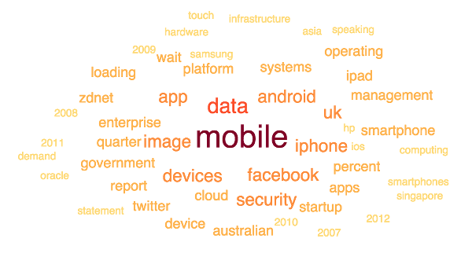
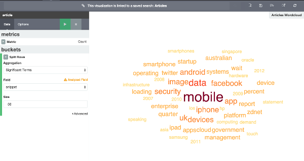

## Kibi/Kibana Word Cloud Plugin    

This is a plugin for [Kibana 4.3+](https://www.elastic.co/products/kibana) and [Kibi 0.3](http://siren.solutions/kibi) (our extention of Kibana for Relational Data).

Plugin display a cloud of words.




## Installation

This plugin can be installed in both:
 
 * [Kibana: 4.3+](https://www.elastic.co/downloads/past-releases/kibana-4-3-0)
 * [Kibi: 0.3+](https://siren.solutions/kibi) (Coming soon ...)

### Automatic

```
bin/kibana plugin --install sirensolutions/kibi-wordcloud-plugin/0.1.0
```
    
### Manuall

```
git clone https://github.com/sirensolutions/kibi-wordcloud-plugin.git
cd kibi-wordcloud-plugin
npm install
npm run build
cp -R build/kibi-wordcloud-plugin KIBANA_FOLDER_PATH/installedPlugins/
```

## Uninstall

```
bin/kibana plugin  --remove kibi-wordcloud-plugin
```

## Development

- Clone the repository at the same level of a Kibana > 4.3 clone
- If needed, switch to the same node version as Kibana using nvm 
  (e.g. `nvm use 0.12`)
- Install dependencies with `npm install`
- Install the plugin to Kibana and start watching for changes by running 
  `npm start`
- run tests with `npm test`

If you are running kibana from folder with a name other than kibana, e.g. kibi

```
gulp dev  --kibanahome=kibi
gulp test --kibanahome=kibi
```


## Breaking changes with respect to the version embedded in Kibi 0.1x and 0.2.x

In the saved/exported visualization:     

- The visualization name changed from `sindicetech_wordcloud` to 
  `kibi_wordcloud`
- The visualization parameter `showMeticsAtAllLevels` is now
  `showMetricsAtAllLevels`